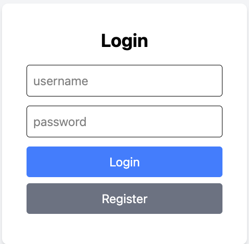
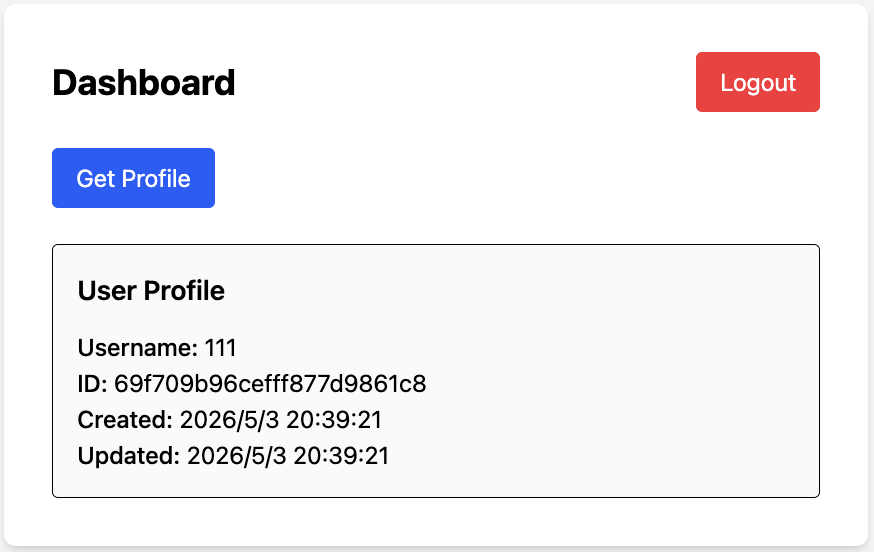

 Fullstack Auth App


A fullstack authentication system built with React, Node.js, Express, MongoDB Atlas, JWT, and Tailwind CSS.
---
Preview
  


---

Live Demo

Local: http://localhost:5173

---

Project Overview

This project demonstrates a complete authentication workflow including user registration, login, protected routes, and profile fetching. It follows a modern fullstack architecture with clear separation between frontend and backend.

---

Features

- User registration and login
- Password hashing with bcrypt
- JWT authentication
- Protected routes using React Router
- Profile API with authentication middleware
- Axios request interceptor (auto attach token)
- Axios response interceptor (auto logout on 401)
- MongoDB Atlas integration
- Tailwind CSS UI
- Loading state handling

---

Tech Stack

### Frontend
- React
- Vite
- React Router
- Axios
- Tailwind CSS

### Backend
- Node.js
- Express
- MongoDB Atlas
- Mongoose
- JWT
- bcrypt
- dotenv
- cors

---

API Endpoints

POST /register  
POST /login  
GET /profile

---

How to Run

Backend

```bash
cd backend
npm install
npm run dev
